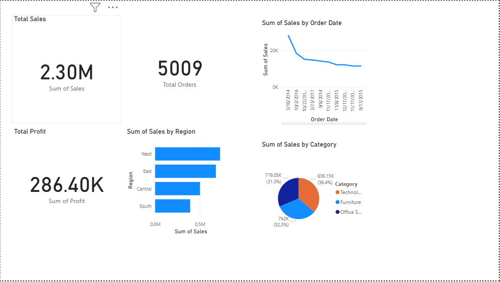

# Retail Sales Analytics Dashboard

This project analyzes enterprise retail sales data using Power BI.

## Dashboard Preview

## KPIs Implemented
- Total Sales
- Total Profit
- Total Orders (DAX Measure)
- Sales by Region
- Sales by Category
- Monthly Sales Trend

## Tools Used
- Power BI
- DAX
- CSV Dataset

## Objective
To build an interactive dashboard that provides insights into sales trends, regional performance, and category contribution.
